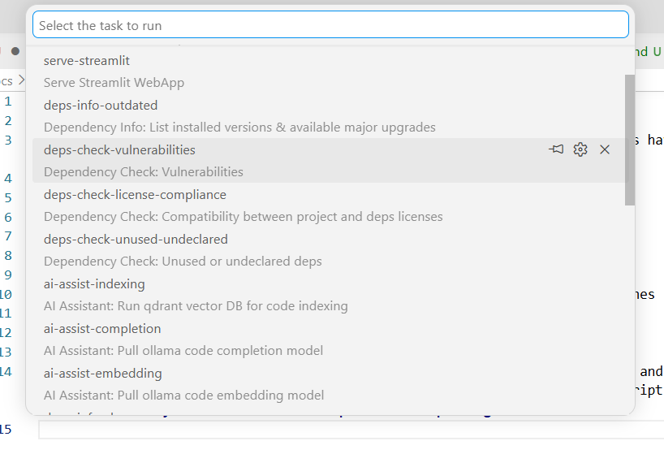

# How to check quality

Certain checks are run by VSCode automatically as you edit code, while others have to be run manually using VSCode tasks or commands in the terminal.

## Automatic checks

- Linting via `ruff`
- Type-checking via `pyright`

> Discovered issues by these tools will show up as yellow or red squiggly lines underlining your code.

## Manual checks

Hit `ctrl` + `shift` + `P` to open the command palette. Then type `Run task` and select the matching command. There you can have a look at all manual check tasks (among others) with names and descriptions. **Please try to run all provided checks and verify that results are adequate before pushing code to main**.

