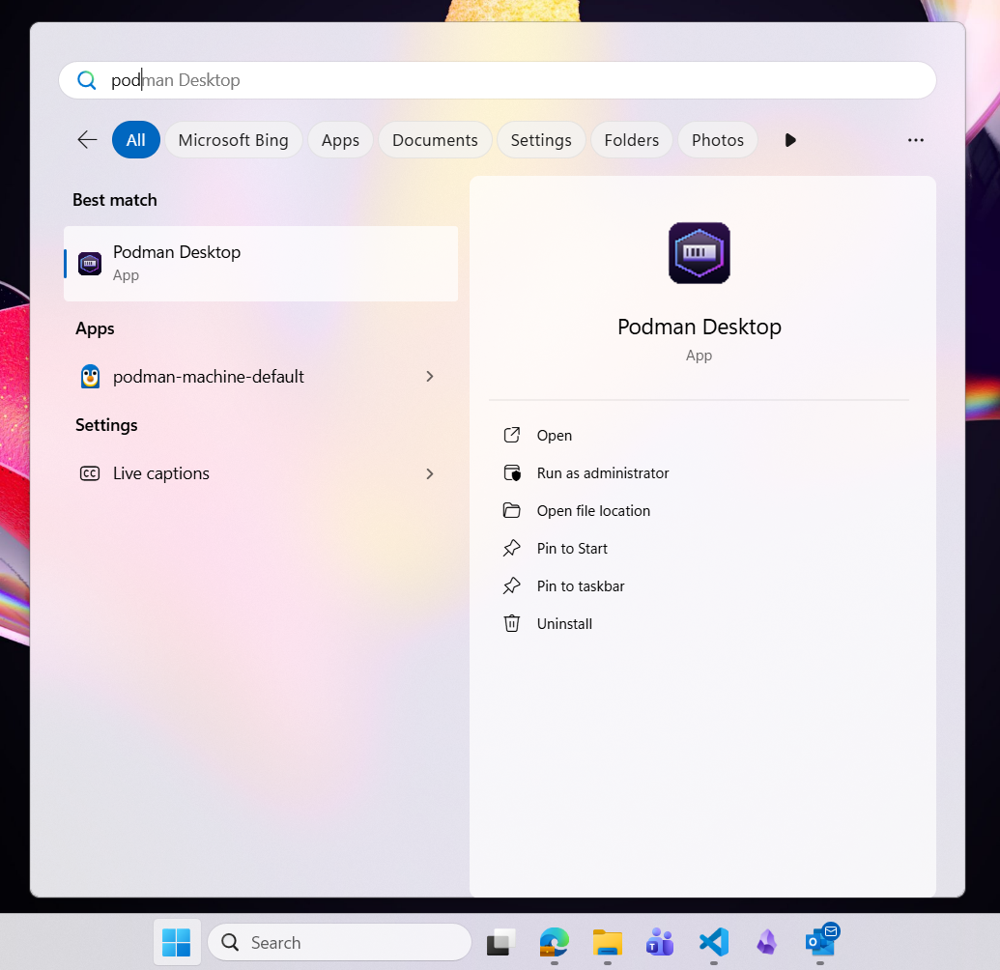
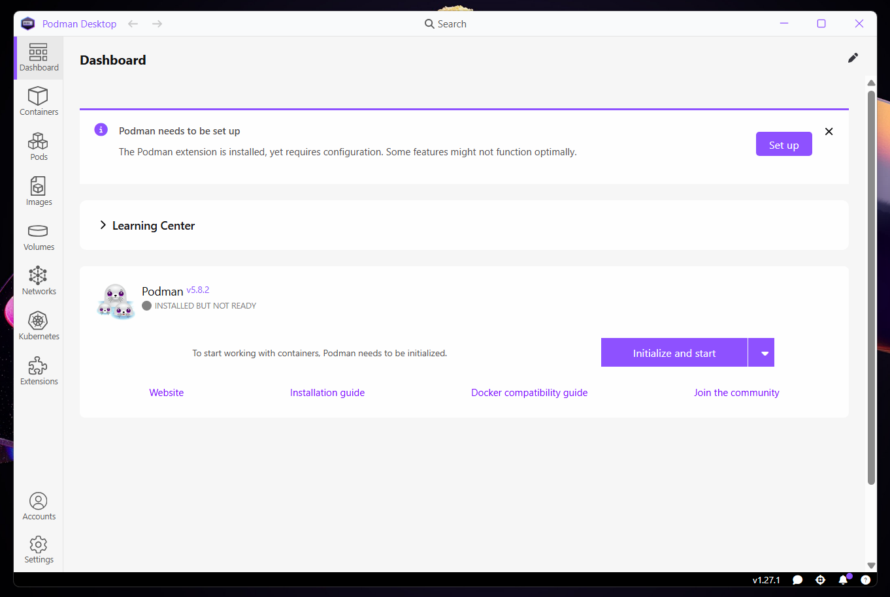
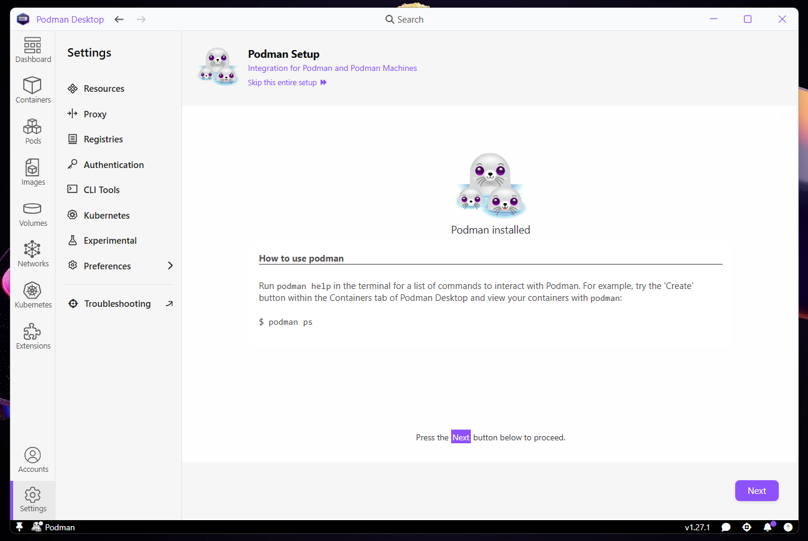
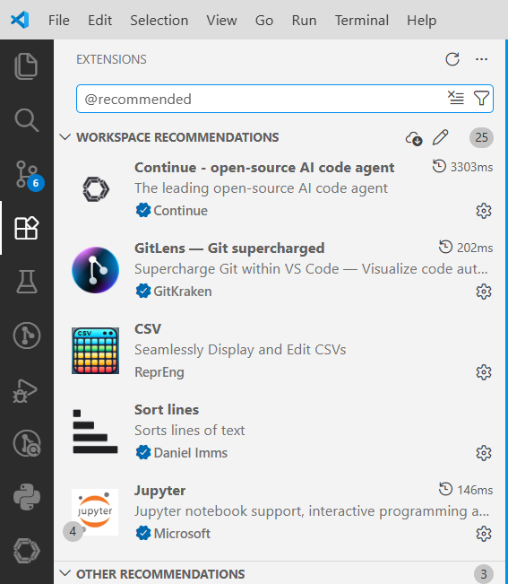
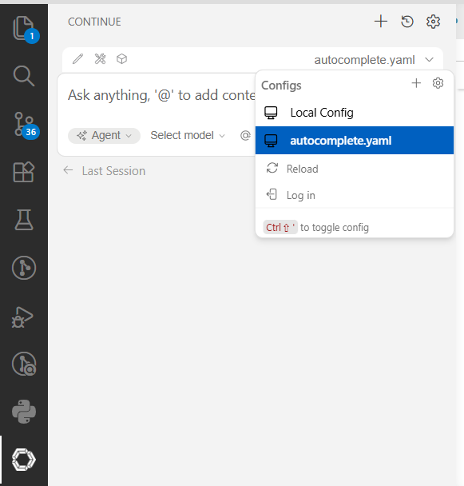
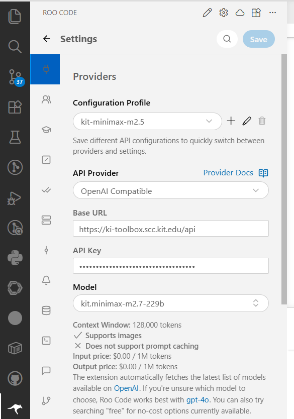
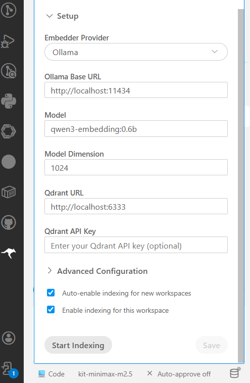

# How to get started

> ⚠️ mind all the inline links. They are helpful :-)

There are a few setup steps needing to be done before you can start using this repo and pasting your own code in.

## 1. System setup

A handful of applications need to be installed directly onto your OS. These are all listed in files contained within this repo, which can be directly parsed by a package manager. Exact steps depend on which OS you have:

### Windows

Download the file `configuration.winget` from the repo's top-level directory, then open your Downloads-folder and double-click the file.

> Installation may take a while depending on the speed of your PC and internet connection.
>
> During installation, you may be asked to grant admin privileges multiple times. Please do so. Installers are all official and verified.

### MacOS or Linux

1. Install [Homebrew](https://brew.sh/)
2. Download the file `Brewfile` from the repo's top-level directory
3. Open a terminal, `cd` to your download folder, and run this command:

  ```bash
  brew bundle install --file Brewfile
  ```

## 2. Configure Podman

> *Podman* is a container runtime that allows you to run Linux-based applications on other systems such as Windows. *Podman Desktop* is a nice GUI on top of *Podman*.

1. Start *Podman Desktop* (search for it in the start menu):

    

2. Click the *Set up* button in the Podman window:

    

3. Click through the setup wizard until you reach this final screen, then click *Next* a final time:

    

Podman should now be running in the background. You may close the window.

## 3. Clone Git repo via VSCode

See this [offical guide](https://code.visualstudio.com/docs/sourcecontrol/repos-remotes#_clone-repositories).

## 4. Install all recommended VSCode extensions

VSCode should prompt you for exactly that right after cloning the repo. If so, click *Yes*. If not, go to the extensions tab in the left sidebar, enter `@recommended` in the search bar and install all manually:



## 5. Install all Python dependencies via UV

Open an integrated terminal in VSCode (e.g. via shortcut `CTRL` + `Ö`) and enter `uv sync`. This should rather quickly install all required packages, as defined in `pyproject.toml`.

> If you have trouble executing `uv` in the terminal, try restarting VSCode or installing UV again [via the official script](https://docs.astral.sh/uv/#__tabbed_1_2).

## 6. Configure AI assistants

1. Close and re-open the VSCode window to make sure that all required background tasks are running.

    > A few terminals always pop up when opening the repo in VSCode. No need to be alarmed. They can be closed once all tasks within are done.

2. Go to the *Continue* tab and select the `autocomplete.yaml` config:

    

3. Go to the *Roo Code* tab, enter settings menua via top-right gear icon ⚙️, and create a new cofiguration profile with details as given by below image. If using the KI-Toolbox by KIT SCC, you can follow [this tutorial](https://www.zml.kit.edu/downloads/KI.Toolbox_API.pdf) (page 4) to generate your API key. Don't forget to hit *Save*.

    

    > Roo Code may ask you to login with their service. **You do not need to login to use the extension**. There should be some button to bypass it.

4. Go back to the Roo chat interface by clicking the pencil icon ✏️ on the top, then click on the bottom right database icon. In the open menu, enter details as given by the image below, then hit *Save* and finally *Start Indexing*. The database icon must turn green after some time, if it worked.

    

> **That's it! Now you should be good to go! 🎉**

## How to continue

- **New to VSCode or IDEs in general?** Check out [the mini VSCode tutorial](./tutorial-ide-vscode.md).
- **New to Roo Code or AI dev assistants in general?** Have a look at [what Roo can doo](./tutorial-roo-code.md) in this repo.
- **Want to get started right away with integrating your code / modules?** Head on over to the [code integration tutorial](./tutorial-code-integration.md).
