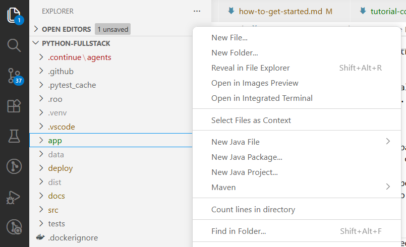
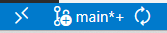
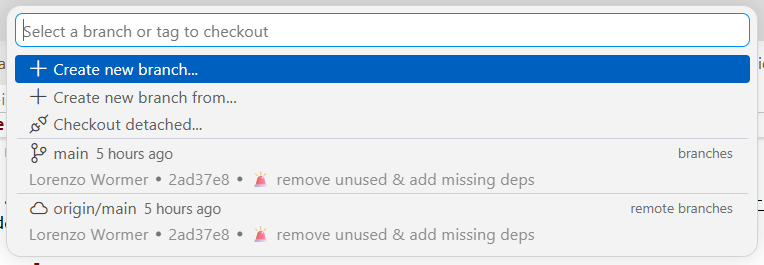
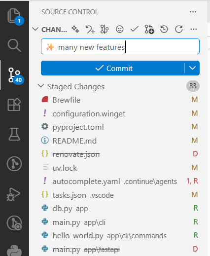
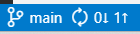
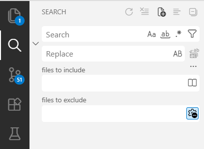
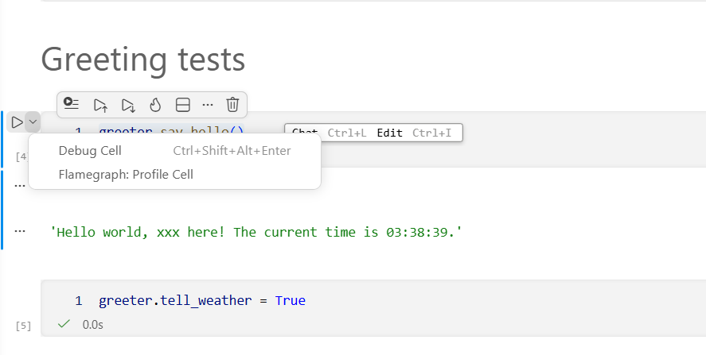
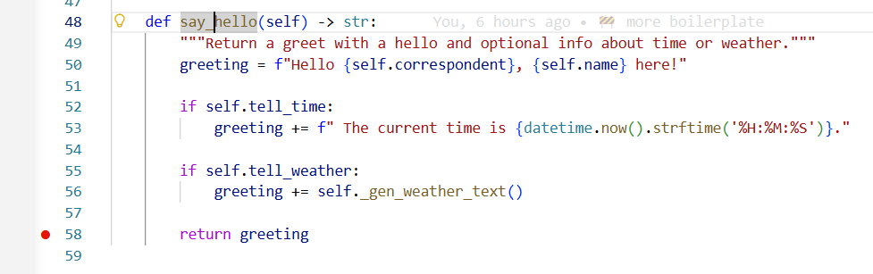
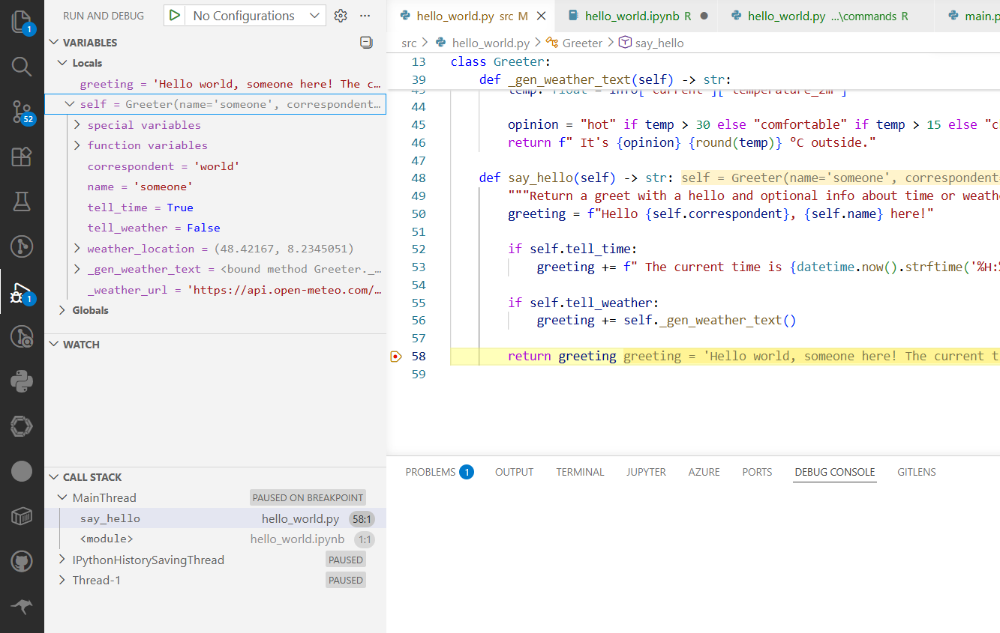

# VSCode IDE Tutorial

For everyone new to working with an IDE, or at least VSCode, this tutorial introduces the most important functions in the context of this repo.

> It is assumed here that you already completed the [getting started guide](how-to-get-started.md) and have thus already used some of VSCode's functions in there.

## File Explorer

The first tab in the left sidebar always shows you the full directory tree of the currently open repo. You can create new files/folders via the buttons up top or in the context menu of a folder (*right click*). Other functions of note in this context menu are:

- *Reveal in File Explorer*: Opens the selected file/folder in your system's file explorer.
- *Find in Folder*: Switches to the *Search* tab for search-and-replace within that folder (see below for details).

> **Exercise 1:** Create a new file named `tutorial.py` in the `src` folder, then open that folder in your system explorer.

## Git GUI

VSCode provides a fully-featured Git GUI, where you can do all the essentials:

- *Checkout branches*: Click on the little `main` on the bottom left of VSCode, then select *Create new branch* and enter the desired branch name.

    

    

    > It should then read the name of the new branch on the bottom left, meaning you are working within that branch now. You can click on it again to switch to other branches (e.g. back to `main`).

- *Stage and commit changes*: In the Git tab, tage via the ➕ icon, enter a concise message, and hit *Commit*.

    

- *Push to the server*: To the right of the branch name, there should be a little 1️⃣⬆️ icon indicating that there are new commits to upload. Click it.

    

> **Exercise 2:** Create a new branch called `tutorial-YOURNAME`, stage and commit your previously created file. Finally, push the commit to the server (if you have access).

## Search & Replace

In the *Search* tab, you can search across all or a subset of files using normal strings or regexes via the `.*` icon.

> Regexes are ***really*** useful. You can use [Regex101](https://regex101.com/) for experimenting with them.

> **Exercise 3:** Try to find out how much of a fanboy I am by counting all occurences of "VSCode" in the `docs` folder.
>
> **Exercise 3 Pro:** Use regexes to find out how many headings (lines starting with one or more "#") are in all the docs.

## Refactor

VSCode can actually understand to some degree what keywords and symbols mean, and use that to search & replace them more specifically. For instance, instead of searching for the text "my_func", which may appear as text *inside* other symbols (e.g. "my_func_2"), you only select the actual occurences of the *symbol* `my_func`.

> **Exercise 4:** Open the file `src/hello_world.py`, right click on the function `hello_world`, and click *Find all References*. Count how many files use this function.
>
> **Exercise 4B:** In the file `src/hello_world.py` again, right click on the function `hello_world` again, and click *Rename Symbol*. Rename it to `say_goodbye`.

## Jupyter Notebook Debugging

You can open Jupyter notebooks directly within VSCode, which allows for neat integrations like running the pretty powerful debugger on single notebook cells.

> **Exercise 5**:
>
> 1. Open the file `app/notebooks/hello_world.ipynb`.
> 2. Run all cells once via the *Run all* button (select your environment in `.venv` as kernel, if asked).
> 3. Go to one of the `greeter.say_hello()` cells.
> 4. Right click on the `say_hello` function and hit *Got to Definition*.
> 5. Put a breakpoint (red dot 🔴) before the return statement by clicking to the left of the line number:
>     
> 6. Go back to the notebook cell, click on the little dropdown next to the play button and select *Debug cell*:
>     
> 7. The debugger should now pause at that breakpoint and you can inspect all variables in the *Debug* tab.
>     
