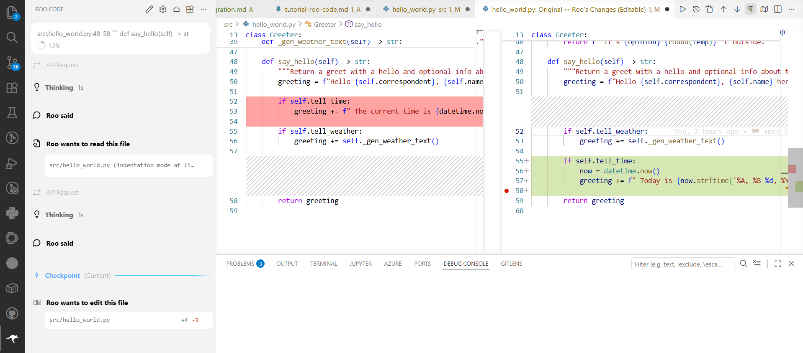

# What Roo can doo for yoo

> (in this repository)

## Modes

Roo has multiple modes with different system prompts, make sure to select the `💻 Code` mode for having it write code and `❓Ask` for just answering questions without producing new code.

## Available Tools

It is useful to know what Roo actually has access to. Within this repo, you can assume that Roo can read all file names and contents, search efficiently through code, look at the Git history, run commands in the Terminal, and search through documentation of third-party dependencies online.

> All of these require your approval at every step unless you enable *Auto-approve*.

## Editor integration

Whenever you select something in the code editor, there should appear a little 💡 icon next to it. Click on the icon and you can have Roo explain the code, improve it, or add it to the context of your current chat.

> **Exercise 1:** Go to any file in the `src` or `app` folder, highlight a portion of code, which puzzles you, and have Roo explain it. If the explanation is not satisfactory, ask a follow-up question in the chat.
>
> **Exercise 2:** Open a new chat in Roo Code, then go to file `/src/hello_world.py`, highlight the entire `say_hello` function, click on the 💡, and select *Add to Roo Code*. Below the added snipped, ask Roo to: "Make the function tell the weather before the time, if enabled, and have the time include the date with some prose phrasing around it." You should get an output similar to this. Accept it and test that it works via the notebook `/app/notebooks/hello_world.ipynb`.
>
> 
